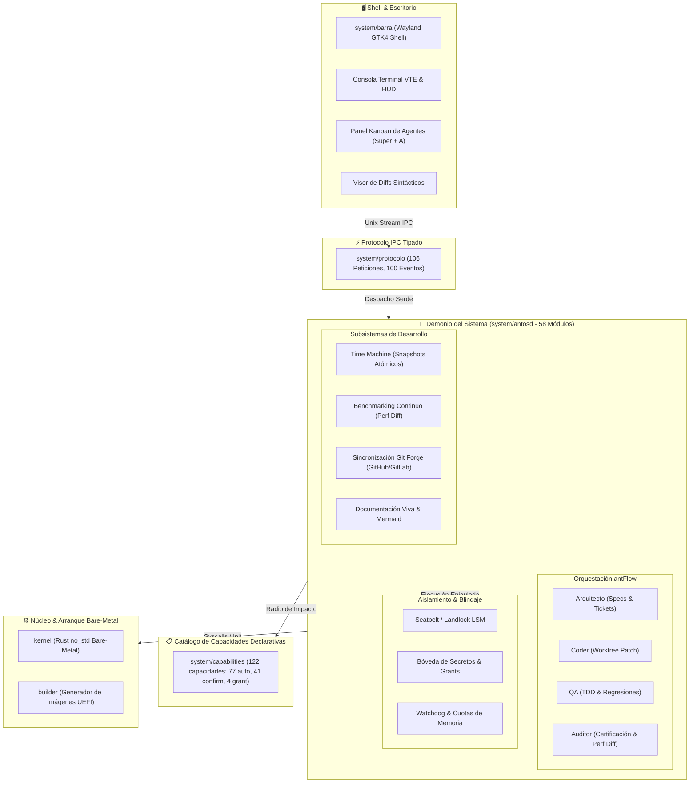
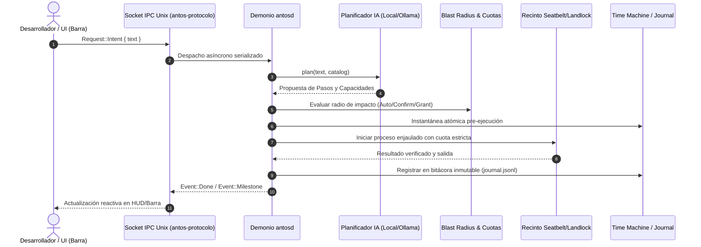
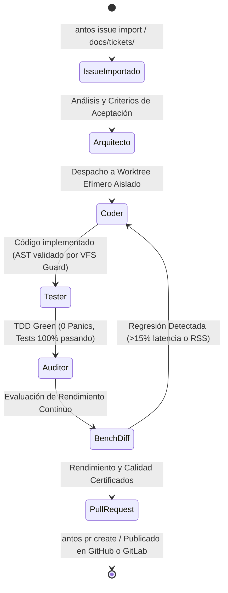

# antOS 🐜⚡

> **El Sistema Operativo Personal para Desarrolladores impulsado por IA y Orquestación Multi-Agente Nativa.**

[](CHANGELOG.md)
[](https://www.rust-lang.org/)
[]()
[]()
[]()
[](docs/tickets/README.md)
[](docs/manual-de-comandos.md)
[](docs/guia-emulacion-utm-virtualbox.md)

---

## 🌟 ¿Qué es antOS?

Los sistemas operativos convencionales (macOS, Windows, Linux) fueron diseñados bajo paradigmas de los años 70 y 90: solo entienden flujos de bytes planos, otorgan **autoridad ambiental total** a cualquier script o agente de IA, y carecen por completo de contexto sobre repositorios Git, puertos de red, pruebas o dependencias de software.

**antOS** es un sistema operativo diseñado desde sus cimientos para el **desarrollador de software**. Transforma la máquina en un entorno donde:
1. **El repositorio y el proyecto son ciudadanos de primera clase:** El sistema comprende ramas activas, diffs en tiempo real, linters, memoria semántica vectorial y grafos de contexto.
2. **Orquestación Multi-Agente Nativa (`antFlow`):** Un equipo de roles especializados (*Arquitecto 📐, Coder 💻, QA 🧪, Auditor 🛡️*) opera localmente como demonios del sistema operativo sobre *Git Worktrees* efímeros y aislados.
3. **Cero Autoridad Ambiental y Recinto de Seguridad (*Sandboxing*):** La IA no ejecuta comandos ciegos en Bash. Planifica contra un catálogo de **capacidades tipadas**, calcula su **radio de impacto (*Blast Radius*)** antes de tocar el disco, opera bajo restricciones del kernel (*Landlock* en Linux / *Seatbelt* en macOS) y protege credenciales `.env`/SSH con **concesiones temporales explícitas (`grants`)**.
4. **Cuotas y Límites de Recursos en Tiempo Real:** Supervisión mediante *Cgroups v2* en Linux y supervisor de procesos con límites duros de memoria RSS y timeout en macOS.
5. **Reversibilidad Nativa (`undo`):** Cada plan, commit o ciclo de desarrollo genera una instantánea atómica previa, permitiendo revertir cualquier cambio con `antos undo` o `antos undo --ticket <id>`.
6. **Superficie de Escritorio Moderna:** Shell Wayland GTK4 de latencia ultra-baja con barra de intenciones contextual, panel de control Kanban (`Super + A`), visor interactivo de diffs sintácticos, consola terminal VTE y bandeja de notificaciones asíncronas.

> 📖 **Para una referencia completa de comandos, banderas y opciones de arranque, consulta el [Manual Completo de Comandos y Métodos de Arranque](docs/manual-de-comandos.md).**

---

## 🏗️ Arquitectura del Sistema

```
 ┌─────────────────────────────────────────────────────────────────────────────┐
 │                         SUPERFICIE DE ESCRITORIO                            │
 │  HUD de Intenciones · Tablero Kanban (Super + A) · Diffs · Consola VTE      │
 │  Bandeja de Notificaciones y Aprobaciones Asíncronas · Insignias Git en Vivo│
 └──────────────────────────────────────┬──────────────────────────────────────┘
                                        │ IPC Tipado (antos-protocolo)
 ┌──────────────────────────────────────▼──────────────────────────────────────┐
 │                      MOTOR DE CONTEXTO Y MULTI-AGENTE                       │
 │  - Orquestador de Agentes antFlow (Arquitecto, Coder, QA, Auditor)          │
 │  - Spec Engine: Parser nativo de tickets Markdown (docs/tickets/)           │
 │  - Memoria Semántica (SQLite Vectorial) & Grafo de Contexto del Proyecto    │
 │  - Motor de Inferencia LLM Local con Ollama (Qwen2.5-Coder) & Fallback      │
 │  - Gestor Declarativo de Entornos y Toolchains (Nix / Devbox)               │
 │  - Analizador Git con caché mtime & Worktrees Efímeros Aislados             │
 │  - Gestor de Servicios Efímeros (Postgres, Redis, MariaDB) & Puertos        │
 │  - Bóveda de Secretos (vault.json) & Sistema de Concesiones (grants)        │
 │  - Bandeja de Notificaciones & Rollback Asíncrono por Ticket                │
 └──────────────────────────────────────┬──────────────────────────────────────┘
                                        │ Capacidades Tipadas & Sandboxing
 ┌──────────────────────────────────────▼──────────────────────────────────────┐
 │                   NÚCLEO DE EJECUCIÓN AISLADA (antosd)                      │
 │  Planificador IA (Local/Ollama/Claude) · Cálculo Blast Radius               │
 │  Recinto Sandbox (Landlock LSM / macOS Seatbelt) & Control de Cuotas        │
 │  Bitácora Inmutable (journal.jsonl) · Instantáneas & Reversión Atómica      │
 └─────────────────────────────────────────────────────────────────────────────┘
```

### Estructura del Workspace (Crates de Rust)

* **[`system/protocolo`](system/protocolo):** Crate `antos-protocolo` con tipos puros de intercambio IPC, serializables con `serde`. Cero dependencias pesadas de I/O.
* **[`system/antosd`](system/antosd):** Demonio `antosd` y CLI `antos`. Contiene el planificador local/Ollama/Claude, orquestador `antFlow`, memoria semántica, gestor de cuotas, recinto sandbox y motor de ejecución.
* **[`system/capabilities`](system/capabilities):** Manifiestos TOML tipados que definen contratos, parámetros, efectos y niveles de riesgo de cada capacidad del desarrollador.
* **[`system/barra`](system/barra):** Shell de escritorio Wayland / GTK4 Layer Shell con barra flotante de intenciones, insignias en vivo, visor de diffs, consola VTE y centro de control Kanban.
* **[`kernel`](kernel):** Núcleo `no_std` en Rust multi-arquitectura con soporte bare-metal para x86_64 y AArch64 (ARM 64-bit), driver de framebuffer/VirtIO-GPU, Desktop Shell nativo con compositor 2D, entrada VirtIO-Input y cargador de ejecutables ELF64.
* **[`user`](user):** `libantos`, la biblioteca de runtime soberana para espacio de usuario (asignador respaldado por `SYS_MMAP`, IPC por canales, `print!`/`println!`/`read_line`), y `antos-init`: el proceso PID 1 con el shell interactivo (`help`, `info`, `ls`, `cat`, `desktop`, `agent`) que arranca sobre el kernel bare-metal.
* **[`builder`](builder):** Ensamblador de imágenes de disco arrancables BIOS (MBR), UEFI (GPT con partición FAT32 ESP) e ISOs híbridas para x86_64 y AArch64.
* **[`docs/tickets`](docs/tickets):** Backlog y especificaciones técnicas maestro (*Spec-Driven Development*).

---

## 🚀 Guía de Inicio y Puesta en Marcha

> **¿Quieres instalar antOS Linux en una máquina?** Descarga la ISO de la
> [release](https://github.com/juandevelop85/antOS/releases)
> (`antos-linux-<versión>-<arch>.iso` + `SHA256SUMS`), grábala y arranca:
> entra directo al escritorio en vivo y `antos install` la instala a disco
> sin red. Guía completa en
> [`docs/guia-live-usb-e-instalacion-fisica.md`](docs/guia-live-usb-e-instalacion-fisica.md)
> (Método 0 y §4-bis). Lo que sigue es la puesta en marcha **en modo host**
> (Mac/Linux de desarrollo).

### 1. Requisitos Previos y Herramientas

* **Rust Toolchain:** `rustc` y `cargo` (1.75 o superior).
* **Git:** 2.30 o superior.
* **Ollama (Opcional para inferencia LLM local offline):** [ollama.com](https://ollama.com) con modelos como `qwen2.5-coder:7b`.
* **Nix / Devbox (Opcional para entornos declarativos):** Para aprovisionar toolchains reproducibles.
* **QEMU / Podman / Docker (Opcional para VM y Kernel):** `qemu-system-x86_64`, `podman` o `docker`.
* **(Opcional para Claude):** Variable de entorno `ANTHROPIC_API_KEY` para planificación en la nube.
* **(Opcional para Desktop Wayland):** `gtk4` y `gtk4-layer-shell`.

### 2. Compilación del Workspace y Verificación

Compila todos los crates del workspace y verifica la suite de pruebas (**154/154 pruebas automatizadas en verde**):

```bash
# Compilar todo el workspace
cargo build --workspace

# Ejecutar la suite completa de pruebas unitarias y de integración
cargo test --workspace
```

### 3. Configurar el Comando `antos` en tu Terminal

Para usar el comando `antos` directamente desde cualquier directorio de tu sistema:

```bash
# Opción A: Instalar el binario directamente en tu PATH (~/.cargo/bin)
cargo install --path system/antosd

# Opción B: Crear un alias en tu shell (~/.zshrc o ~/.bashrc)
alias antos="$(pwd)/target/debug/antos"
```

#### Variables de Entorno de antOS

antOS autodescubre el contexto, pero puedes personalizar su comportamiento:

| Variable | Descripción | Valor por Defecto |
| :--- | :--- | :--- |
| `ANTOS_WORKSPACE` | Raíz del proyecto en el que opera antOS | Raíz del repositorio Git actual o `pwd` |
| `ANTOS_STATE` | Directorio de estado (bitácora, servicios, bóveda de secretos) | `.antos/` en el workspace o `~/.local/state/antos/` |
| `ANTOS_SOCKET` | Ruta del socket UNIX del demonio | `$ANTOS_STATE/antos.sock` |
| `ANTOS_CAPABILITIES` | Directorio con los manifiestos TOML de capacidades | `system/capabilities/` |
| `OLLAMA_HOST` | URL del servidor Ollama para inferencia local | `http://localhost:11434` |
| `ANTHROPIC_API_KEY` | Clave de API de Anthropic para el planificador Claude | `~/.config/antos/anthropic.key` |

---

## 🕹️ Modos de Ejecutar e Iniciar antOS

antOS cuenta con **7 métodos de arranque** adaptados a cada escenario:

```
 ┌─────────────────────────────────────────────────────────────────────────────┐
 │                       7 FORMAS DE INICIAR antOS                             │
 ├─────────────────────────────────────────────────────────────────────────────┤
 │ 1. CLI y Centro de Control (Host): Desarrollo diario en macOS y Linux       │
 │ 2. Demonio IPC en Segundo Plano: Escucha en socket UNIX y atiende clientes  │
 │ 3. Shell Gráfico Wayland (GTK4): HUD contextual flotante y Kanban (Super+A) │
 │ 4. Contenedor Linux (Landlock LSM): Verificación de aislamiento kernel      │
 │ 5. Máquina Virtual NixOS en QEMU: Sistema operativo completo y servicios    │
 │ 6. Kernel Bare-Metal no_std en QEMU: Framebuffer, Desktop Shell y Shell PID1│
 │ 7. Live USB e Instalación Física: Arranque autónomo en NVMe/SATA reales    │
 └─────────────────────────────────────────────────────────────────────────────┘
```

> 📖 **Para conocer todas las combinaciones de banderas y opciones avanzadas, consulta el [Manual Completo de Comandos y Métodos de Arranque](docs/manual-de-comandos.md).**

---

## 🛠️ Guía Rápida de Comandos por Subsistema

### 1. Planificación e Intenciones en Lenguaje Natural
```bash
# Ejecución interactiva con cálculo de radio de impacto
antos "crea un proyecto rust llamado api-service"

# Modo simulación (dry-run): inspecciona el diff y plan sin modificar nada
antos -n "actualiza las dependencias de cargo y compila"

# Usar el modelo LLM local Ollama
antos -p ollama "optimiza las consultas del módulo memory.rs"
```

### 2. Orquestador Multi-Agente (`antFlow`) y Tablero Kanban
```bash
# Consultar el equipo de agentes especializados del sistema operativo
antos agents

# Despachar un ticket técnico (Arquitecto -> Coder -> QA -> Auditor)
antos agent run T1.1 --auto

# Consultar el estado y worktree activo del ticket
antos agent status T1.1

# Abrir el Tablero Kanban y monitor de agentes en consola
antos panel
```

### 3. Visor de Diffs Interactivo y Consola VTE
```bash
# Inspeccionar diffs sintácticos del proyecto actual (o escanear workspace/)
antos diff

# Inspeccionar exclusivamente los cambios de un proyecto específico
antos diff api-service

# Comparar un proyecto contra una rama o referencia específica
antos diff api-service main

# Consola terminal interactiva VTE embebida
antos terminal
antos terminal "cargo check"
```

### 4. Bandeja de Notificaciones y Aprobaciones Asíncronas
```bash
# Consultar la bandeja de alertas y revisiones pendientes
antos notify

# Aprobar cambios y fusionar el worktree del agente
antos notify approve notif-t8-2

# Rechazar y ejecutar rollback inmediato del worktree
antos notify reject notif-t8-2

# Limpiar notificaciones leídas
antos notify clear
```

### 5. Memoria Semántica y Grafo de Contexto
```bash
# Indexar el proyecto con vectores de términos y dependencias
antos memory index

# Búsqueda semántica por similitud coseno
antos memory search "orquestación multi-agente en worktrees"

# Visualizar el grafo de dependencias bidireccional
antos memory graph system/antosd/src/main.rs
```

### 6. Perfiles Declarativos Nix y Devbox
```bash
# Diagnosticar toolchains instaladas en el workspace
antos env status

# Inicializar un perfil de lenguaje (.antos/env.toml, devbox.json, flake.nix)
antos env init rust
antos env init python

# Sincronizar toolchains y dependencias
antos env sync
```

### 7. Cuotas y Límites de Recursos para Sandboxes
```bash
# Ver límites actuales de CPU, memoria RAM, PIDs y timeout
antos quota status

# Configurar límites estrictos para tareas de agentes
antos quota set --timeout 60 --memory 1024 --cpu 80 --pids 128

# Restablecer cuotas por defecto
antos quota reset
```

### 8. Bóveda de Secretos y Concesiones (Zero Environmental Authority)
```bash
# Guardar un secreto de forma segura (cifrado / 0600)
antos secret set GITHUB_TOKEN ghp_1122334455

# Listar secretos (lectura bloqueada sin concesión)
antos secrets

# Otorgar una concesión temporal con justificación
antos grant secret.GITHUB_TOKEN --minutos 15 --para "sincronizar releases"

# Leer el secreto concedido
antos secret get GITHUB_TOKEN

# Revocar el acceso
antos revoke secret.GITHUB_TOKEN
```

### 9. Servicios Locales Efímeros (Ollama / PostgreSQL / Redis)
```bash
# Ollama: adopta el que ya corre en 11434 o arranca uno propio (binario o nix)
antos service up ollama

# Levantar PostgreSQL local efímero (proceso real, initdb la primera vez)
antos service up postgres

# Consultar servicios activos y variables inyectadas (.env)
antos services

# Detener el servicio cuando termines
antos service down postgres
```

### 10. Reversión Atómica Instantánea (`undo`)
```bash
# Revertir la última transacción ejecutada restaurando el snapshot atómico
antos undo

# Revertir todos los commits y cambios asociados a un ticket técnico
antos undo --ticket T1.1
```

### 11. Gestión Declarativa de Proyectos, Selección Activa y Git (`antos use` / `antos project`)
```bash
# Listar todos los proyectos en workspace/ con su estado Git y stack
antos project list

# Seleccionar un proyecto activo para que todos los comandos operen sobre él
antos use api-service

# Consultar el proyecto actualmente seleccionado y su origen
antos use

# Listar tickets del proyecto seleccionado (sin necesidad de flags adicionales)
antos tickets

# Consultar el estado de Git del proyecto activo
antos git status

# Limpiar la selección activa y regresar a detección automática / ámbito global
antos use --clear

# Inicializar repositorio Git aislado con rama main y .gitignore adaptado al stack
antos project init api-service
antos git init api-service

# Especificar rama y stack de forma explícita
antos project init web-app --branch develop --lang typescript
```

### 12. Arranque Multi-Arquitectura Bare-Metal y Generador UEFI (`builder`)
```bash
# Compilar y arrancar el kernel x86_64 en BIOS Legacy
./run.sh

# Compilar el kernel para AArch64 (ARM 64-bit bare-metal no_std)
cargo build --target aarch64-unknown-none --manifest-path kernel/Cargo.toml

# Generar imágenes UEFI GPT (ESP FAT32 BOOTAA64.EFI / BOOTX64.EFI) e ISO híbrida con builder
cargo run -p builder -- kernel/target/aarch64-unknown-none/debug/kernel

# Ejecutar el kernel AArch64 directamente en QEMU virt (consola PL011, MMU, VBAR_EL1, GIC y SVC)
qemu-system-aarch64 -M virt -cpu cortex-a72 -nographic -kernel kernel/target/aarch64-unknown-none/debug/kernel -serial stdio -monitor none

# En UTM (macOS Apple Silicon):
# Crear VM ARM64 ('virt'), desactivar 'UEFI Boot', añadir dispositivo 'Puerto Serie (Terminal)'
# y seleccionar 'kernel/target/aarch64-unknown-none/debug/kernel' en arranque directo de Kernel.

# En VirtualBox para Mac Apple Silicon (ARM64):
# Convertir disco UEFI ARM64 a VDI y añadir como disco duro SATA/SCSI con puerto serie activado:
VBoxManage convertfromraw kernel/target/aarch64-unknown-none/debug/antos-uefi-aarch64.img antos-arm64.vdi --format VDI

# En VirtualBox para x86_64 (Intel/AMD):
# Convertir imagen BIOS a VDI y desactivar 'Habilitar EFI' en Sistema -> Placa Base:
VBoxManage convertfromraw kernel/target/x86_64-unknown-none/debug/antos-bios.img antos-x86.vdi --format VDI
```

Al llegar al arranque, la consola serie entrega el **shell interactivo soberano de antOS** (`antos-init`, PID 1, sin `glibc`/`musl` — T26.5), con memoria dinámica propia (`libantos`) y estos comandos integrados:

```
antos> help                 # lista los comandos disponibles
antos> info                 # arquitectura, heap usado y ticks de actividad del kernel
antos> ls /                 # contenido del VFS (initramfs/tarfs) montado en el arranque
antos> cat /etc/antos.conf  # muestra un fichero de texto del VFS
antos> desktop               # renderiza (x86_64) o cede el control a (AArch64) el Desktop Shell nativo (T26.2)
antos> agent "optimiza memory.rs"  # encola una intención en un canal IPC del kernel para el puente antFlow
```

> 📖 **Para una guía detallada paso a paso con resolución de problemas y capturas, consulta la [Guía de Emulación en UTM, VirtualBox y QEMU](docs/guia-emulacion-utm-virtualbox.md).**

---

### 14. Creación de Live USB e Instalación en Hardware Físico (`antos usb` / `antos install`)

```bash
# 1. Construir la imagen híbrida autoarrancable (UEFI + MBR) y calcular suma SHA-256
antos usb build --arch x86_64 --out antos-live.iso

# 2. Listar unidades USB y medios extraíbles elegibles (con salvaguarda de discos internos)
antos usb list

# 3. Grabar la imagen en el pendrive con streaming por bloques de 4 MiB y verificación SHA-256
antos usb flash --image antos-live.iso --target /dev/sdb --apply

# 4. En el equipo destino físico arrancado desde el Live USB, lanzar el asistente guiado:
antos install
```

> 📖 **Para instrucciones completas de arranque, compatibilidad directa con Ventoy, Rufus, BalenaEtcher y configuración UEFI/AHCI, consulta la [Guía de Creación de Live USB e Instalación Física](docs/guia-live-usb-e-instalacion-fisica.md).**

---


### 13. Ecosistema Multi-LLM y Catálogo de Modelos Gratuitos (`antos llm`)
```bash
# Diagnóstico integral de motores LLM, endpoints, latencia y claves en bóveda
antos llm status

# Catálogo interactivo de modelos 100% gratuitos (Groq, OpenRouter, Gemini, OpenCode, Ollama)
antos llm free

# Cambiar el motor activo del sistema operativo dinámicamente
antos llm use groq --model llama-3.3-70b-versatile
antos llm use openrouter --model deepseek/deepseek-r1:free
antos llm use gemini --model gemini-2.0-flash
antos llm use ollama --model qwen2.5-coder:latest
antos llm use opencode --endpoint http://127.0.0.1:8080/v1
antos llm use local               # Planificador determinista offline sin GPU ni red

# Restablecer selección automática por jerarquía
antos llm use --clear

# Prueba interactiva de inferencia y Tool Calling en tiempo real
antos llm test
```

---

## 📋 Catálogo Completo de Capacidades (`system/capabilities/`)

| Capacidad | Descripción | Nivel de Riesgo |
| :--- | :--- | :--- |
| `git.status` | Introspección y estado estructurado del repositorio Git | `auto` (Lectura) |
| `git.commit_semantic` | Generación y aplicación de commits semánticos validados | `confirm` |
| `git.smart_branch` | Creación y cambio contextual de ramas | `confirm` |
| `git.worktree_create` | Creación de worktrees efímeros aislados para agentes | `confirm` |
| `git.worktree_cleanup` | Limpieza y eliminación de worktrees temporales | `confirm` |
| `git.worktree_merge` | Fusión de ramas de trabajo de agentes a la rama base | `confirm` |
| `diag.port_status` | Diagnóstico de puertos TCP de desarrollo y procesos en escucha | `auto` (Lectura) |
| `diag.port_kill` | Liberación controlada de puertos en conflicto (SIGTERM/SIGKILL) | `confirm` |
| `env.service_up` | Arranca (o adopta si ya escucha) un servicio local real en loopback: Ollama, Postgres, Redis, Meilisearch | `confirm` |
| `env.service_down` | Detiene un servicio arrancado por antOS (los datos se conservan) o retira el registro de uno adoptado | `confirm` |
| `env.service_status` | Estado real de los servicios registrados: PID y sonda del puerto | `auto` (Lectura) |
| `secret.set` | Almacenamiento seguro de secretos en la bóveda con cifrado/0600 | `confirm` |
| `secret.get` / `secret.read` | Lectura de credenciales protegida por el sistema de concesiones | `grant` |
| `secret.grant` | Concesión explícita temporal de acceso a un secreto o `.env` | `grant` |
| `secret.revoke` | Revocación inmediata de una concesión activa | `confirm` |
| `secret.list` | Listado de secretos y estado de concesiones activas | `auto` (Lectura) |
| `llm.status` | Diagnóstico del motor de inferencia LLM local Ollama | `auto` (Lectura) |
| `llm.list` | Listado de modelos LLM locales disponibles | `auto` (Lectura) |
| `memory.index` | Indexación sintáctica y vectorial del workspace en SQLite | `confirm` |
| `memory.search` | Búsqueda semántica por similitud coseno en memoria local | `auto` (Lectura) |
| `memory.graph` | Consulta del grafo de dependencias y contexto del proyecto | `auto` (Lectura) |
| `env.init` | Inicialización de perfiles de entorno declarativo (Nix/Devbox) | `confirm` |
| `env.sync` | Sincronización y validación de toolchains del proyecto | `confirm` |
| `env.profile_status` | Diagnóstico de perfiles y toolchains activas | `auto` (Lectura) |
| `quota.status` | Inspección de cuotas de CPU, memoria y timeouts de sandbox | `auto` (Lectura) |
| `quota.set` | Configuración de límites y cuotas de confinamiento | `confirm` |
| `ui.diff_viewer` | Visor interactivo de diffs estructurados y coloreados sintácticamente | `auto` (Lectura) |
| `ui.terminal` | Consola terminal interactiva VTE embebida | `auto` |
| `notify.list` | Consulta de la bandeja de notificaciones y aprobaciones de agentes | `auto` (Lectura) |
| `notify.action` | Ejecución de acciones de aprobación, rechazo o rollback | `confirm` |
| `mesh.status` | Muestra el estado del nodo local y los peers en la red P2P antMesh | `auto` (Lectura) |
| `mesh.connect` | Conecta a un nodo peer remoto mediante IP o multiaddr (QUIC) | `confirm` |
| `mesh.pair` | Genera un token seguro de emparejamiento con 15m de expiración | `auto` |
| `flow.swarm_status` | Inspección de nodos y matriz de distribución de agentes en el Swarm | `auto` (Lectura) |
| `flow.dispatch_remote` | Despacho distribuido de roles antFlow a nodos con sincronización de worktrees | `confirm` |
| `vfs.query` | Consulta símbolos, nodos del AST o diffs proyectados en /antfs | `auto` (Lectura) |
| `vfs.mount` | Monta la proyección del sistema de ficheros virtual /antfs en el workspace | `confirm` |
| `vfs.unmount` | Desmonta y limpia el punto de montaje virtual /antfs | `confirm` |
| `vfs.validate_write` | Intercepta y valida sintaxis de archivos en memoria previa a disco | `auto` |
| `vfs.guard_status` | Métricas y estado del interceptor de escrituras semánticas | `auto` (Lectura) |
| `ebpf.status` | Diagnóstico de compatibilidad y sondas eBPF LSM activas en el kernel | `auto` (Lectura) |
| `ebpf.audit_log` | Lectura del registro en vivo de syscalls y eventos de seguridad eBPF | `auto` (Lectura) |
| `profile.run` | Ejecución y perfilado en tiempo real de comandos (CPU, RSS, page faults) | `auto` |
| `profile.analyze` | Análisis de puntos calientes (hotspots) y sugerencias técnicas de optimización | `auto` (Lectura) |
| `lsp.start` | Inicia el servidor Language Server Protocol (LSP) sobre stdio para editores | `auto` |
| `lsp.status` | Diagnóstico de conexiones y símbolos indexados en el servidor LSP | `auto` (Lectura) |
| `collab.session` | Inicia o une una sesión interactiva de pair programming con el Coder mediante CRDT | `confirm` |
| `dap.attach` | Conecta una sesión de depuración supervisada DAP a un proceso dentro del sandbox | `auto` |
| `project.scaffold` | Creación y andamiaje inicial de proyectos con Git y .gitignore nativo | `confirm` |
| `project.git_init` | Inicialización atómica de repositorio Git aislado y .gitignore por stack | `confirm` |
| `disk.list` | Enumeración de discos físicos, buses y particiones del host | `auto` (Lectura) |
| `disk.inspect` | Diagnóstico profundo de geometría y particiones GPT | `auto` (Lectura) |
| `disk.partition` | Particionador declarativo GPT (disco limpio o Dual Boot) | `confirm` |
| `install.deploy` | Asistente e instalador de sistema base a disco duro / NVMe | `confirm` |
| `bootloader.install` | Instalador y configurador UEFI de systemd-boot y entradas NVRAM | `confirm` |
| `microvm.spawn` | Aprovisionamiento y arranque de microVMs efímeras hipervisor KVM | `confirm` |
| `pkg.install` / `pkg.remove` | Gestor de paquetes y recetas inmutables antpkg con generaciones | `confirm` |
| `autopilot.start` / `autopilot.scan` | Modo agente autónomo continuo (Autopilot Daemon) y centinela | `confirm` |
| `web.start` / `web.status` | Servidor de consola web remota en tiempo real y bridge WebSocket | `confirm` |
| `pkg.declare` | Declaración de dependencias en manifiestos de proyecto | `confirm` |
| `fs.write` / `fs.delete` | Modificación y eliminación controlada de archivos con instantánea | `confirm` / `grant` |
| `system.declare` | Modificación de la configuración declarativa del sistema | `grant` |

---

## 🗺️ Hoja de Ruta y Backlog de Desarrollo

El desarrollo de antOS se gestiona bajo la metodología **Spec-Driven Development** en [`docs/tickets/`](docs/tickets/):

| Fase | Título | Estado |
| :--- | :--- | :--- |
| **Fase 0** | [T0.1](docs/tickets/T0.1-renombrado-de-syso-a-antos.md) · Renombrado integral del sistema a `antOS` | ✅ Completado |
| **Fase 1** | [T1.1](docs/tickets/T1.1-protocolo-introspeccion-git.md) · Extensión de `antos-protocolo` para introspección Git | ✅ Completado |
| **Fase 1** | [T1.2](docs/tickets/T1.2-analizador-git-en-demonio.md) · Analizador de repositorios Git en segundo plano con caché `mtime` | ✅ Completado |
| **Fase 1** | [T1.3](docs/tickets/T1.3-spec-engine-tickets-parser.md) · Indexador y parser nativo de especificaciones y tickets Markdown | ✅ Completado |
| **Fase 2** | [T2.1](docs/tickets/T2.1-capacidades-git-semantico.md) · Capacidades tipadas para Git (`status`, `commit_semantic`, `branch`) | ✅ Completado |
| **Fase 2** | [T2.2](docs/tickets/T2.2-capacidades-worktrees-aislados.md) · Capacidad de gestión de *Git Worktrees* efímeros para agentes | ✅ Completado |
| **Fase 2** | [T2.3](docs/tickets/T2.3-diagnostico-de-puertos-y-procesos.md) · Capacidad de diagnóstico y liberación de puertos en colisión | ✅ Completado |
| **Fase 3** | [T3.1](docs/tickets/T3.1-roles-y-maquina-de-estados-de-agentes.md) · Orquestador de roles multi-agente (`antFlow` Core en Rust) | ✅ Completado |
| **Fase 3** | [T3.2](docs/tickets/T3.2-flujo-ejecucion-paralela-en-worktrees.md) · Ejecución paralela de tareas en worktrees con validación de tests | ✅ Completado |
| **Fase 3** | [T3.3](docs/tickets/T3.3-consolidador-de-diffs-y-rollback-por-ticket.md) · Consolidador de diffs y reversión granular por ticket (`undo --ticket`) | ✅ Completado |
| **Fase 4** | [T4.1](docs/tickets/T4.1-barra-intencion-actualizada.md) · Adaptación y enriquecimiento de la barra de intenciones Wayland/GTK4 | ✅ Completado |
| **Fase 4** | [T4.2](docs/tickets/T4.2-panel-centro-de-agentes-y-tickets.md) · Centro de control de agentes y tablero de tickets (`Super + A`) | ✅ Completado |
| **Fase 5** | [T5.1](docs/tickets/T5.1-servicios-locales-efimeros-nix.md) · Aprovisionamiento declarativo de servicios efímeros (Postgres, Redis) | ✅ Completado |
| **Fase 5** | [T5.2](docs/tickets/T5.2-boveda-segura-de-secretos-y-grants.md) · Bóveda de secretos y blindaje de `.env`/claves SSH con concesiones | ✅ Completado |
| **Fase 6** | [T6.1](docs/tickets/T6.1-motor-de-inferencia-llm-local-con-ollama-y-fallback-offline.md) · Motor de Inferencia LLM Local con Ollama y Fallback Offline | ✅ Completado |
| **Fase 6** | [T6.2](docs/tickets/T6.2-memoria-semántica-y-grafo-de-contexto-del-proyecto-con-sqlite-vectorial.md) · Memoria Semántica y Grafo de Contexto del Proyecto con SQLite Vectorial | ✅ Completado |
| **Fase 7** | [T7.1](docs/tickets/T7.1-gestor-de-perfiles-de-entorno-declarativo-nix-y-devbox-por-proyecto.md) · Gestor de Perfiles de Entorno Declarativo Nix y Devbox por Proyecto | ✅ Completado |
| **Fase 7** | [T7.2](docs/tickets/T7.2-control-de-cuotas-de-cpu-y-memoria-para-sandboxes-de-agentes.md) · Control de Cuotas de CPU y Memoria para Sandboxes de Agentes | ✅ Completado |
| **Fase 8** | [T8.1](docs/tickets/T8.1-visor-de-diffs-interactivo-y-terminal-embebido-en-wayland.md) · Visor de Diffs Interactivo y Terminal Embebido en Wayland | ✅ Completado |
| **Fase 8** | [T8.2](docs/tickets/T8.2-bandeja-de-notificaciones-y-aprobaciones-asíncronas-para-agentes.md) · Bandeja de Notificaciones y Aprobaciones Asíncronas para Agentes | ✅ Completado |
| **Fase 9** | [T9.1](docs/tickets/T9.1-protocolo-de-red-p2p-cifrado-antmesh-con-descubrimiento-mdns-y-quic.md) · Protocolo de Red P2P Cifrado (antMesh) con Descubrimiento mDNS y QUIC | ✅ Completado |
| **Fase 9** | [T9.2](docs/tickets/T9.2-despacho-distribuido-de-roles-antflow-a-nodos-de-gpu-y-sincronización-de-worktrees.md) · Despacho Distribuido de Roles antFlow a Nodos de GPU y Sincronización | ✅ Completado |
| **Fase 10** | [T10.1](docs/tickets/T10.1-sistema-de-ficheros-virtual-fuse-para-inspección-de-ast-símbolos-y-diffs-antfs.md) · Sistema de Ficheros Virtual FUSE para Inspección de AST, Símbolos y Diffs (/antfs) | ✅ Completado |
| **Fase 10** | [T10.2](docs/tickets/T10.2-interceptores-de-escritura-semántica-con-validación-tipada-previa-a-disco.md) · Interceptores de Escritura Semántica con Validación Tipada Previa a Disco | ✅ Completado |
| **Fase 11** | [T11.1](docs/tickets/T11.1-supervisor-kernel-ebpf-lsm-para-detección-de-fugas-de-sandbox-y-syscalls-anómalas.md) · Supervisor Kernel eBPF (LSM) para Detección de Fugas de Sandbox y Syscalls | ✅ Completado |
| **Fase 11** | [T11.2](docs/tickets/T11.2-profiler-continuo-de-cpu-y-memoria-en-runtime-con-sugerencias-de-optimización-para-agentes.md) · Profiler Continuo de CPU y Memoria en Runtime con Sugerencias de Optimización | ✅ Completado |
| **Fase 12** | [T12.1](docs/tickets/T12.1-servidor-language-server-protocol-lsp-unificado-alimentado-por-la-memoria-semántica.md) · Servidor LSP Unificado Alimentado por la Memoria Semántica | ✅ Completado |
| **Fase 12** | [T12.2](docs/tickets/T12.2-edición-colaborativa-en-vivo-humano-agente-y-protocolo-dap-de-depuración-aislada.md) · Edición Colaborativa en Vivo Humano-Agente y Protocolo DAP de Depuración Aislada | ✅ Completado |
| **Fase 13** | [T13.0](docs/tickets/T13.0-compositor-wayland-ultraligero-y-configuración-declarativa-de-sesión-de-escritorio.md) · Compositor Wayland Ultraligero y Configuración Declarativa de Sesión | ✅ Completado |
| **Fase 13** | [T13.1](docs/tickets/T13.1-integracion-de-telemetria-ebpf-profiler-y-pair-programming-en-la-barra-wayland-gtk4.md) · Telemetría eBPF, Profiler y Pair Programming en Barra Wayland | ✅ Completado |
| **Fase 13** | [T13.2](docs/tickets/T13.2-pipeline-de-arranque-bare-metal-compilacion-cruzada-de-kernel-y-disco-bios-uefi-en-qemu.md) · Pipeline de Arranque Bare Metal, Kernel y QEMU | ✅ Completado |
| **Fase 14** | [T14.1](docs/tickets/T14.1-motor-de-capacidades-y-plugins-en-webassembly-wasi-con-aislamiento-de-memoria.md) · Motor de Capacidades y Plugins en WebAssembly (WASI) | ✅ Completado |
| **Fase 14** | [T14.2](docs/tickets/T14.2-agente-multimodal-con-captura-de-pantalla-wayland-para-inspeccion-y-qa-visual.md) · Agente Multimodal con Captura Wayland e Inspección Visual | ✅ Completado |
| **Fase 14** | [T14.3](docs/tickets/T14.3-generador-de-live-iso-autonoma-empaquetado-release-y-distribucion-v0.1.0.md) · Generador de Live ISO Autónoma y Empaquetado Release v0.1.0 | ✅ Completado |
| **Fase 15** | [T15.1](docs/tickets/T15.1-motor-de-inspeccion-de-almacenamiento-y-particionador-gpt.md) · Motor de Inspección de Almacenamiento y Particionador GPT | ✅ Completado |
| **Fase 15** | [T15.2](docs/tickets/T15.2-instalador-guiado-de-sistema-base-disco-completo-y-dual-boot.md) · Instalador Guiado de Sistema Base (Disco Completo y Dual Boot) | ✅ Completado |
| **Fase 15** | [T15.3](docs/tickets/T15.3-gestor-de-arranque-uefi-y-dual-boot-automatizado.md) · Gestor de Arranque UEFI y Dual Boot Automatizado | ✅ Completado |
| **Fase 16** | [T16.1](docs/tickets/T16.1-microvms-efimeras-y-aislamiento-por-hipervisor-kvm.md) · MicroVMs Efímeras y Aislamiento por Hipervisor (KVM / Cloud-Hypervisor) | ✅ Completado |
| **Fase 16** | [T16.2](docs/tickets/T16.2-gestor-de-paquetes-y-recetas-inmutables-antpkg.md) · Gestor de Paquetes y Recetas Inmutables (`antpkg`) | ✅ Completado |
| **Fase 16** | [T16.3](docs/tickets/T16.3-modo-agente-autonomo-continuo-autopilot-daemon.md) · Modo Agente Autónomo Continuo (*Autopilot Daemon*) | ✅ Completado |
| **Fase 16** | [T16.4](docs/tickets/T16.4-consola-web-remota-en-tiempo-real-y-bridge-websocket.md) · Consola Web Remota en Tiempo Real y Bridge WebSocket | ✅ Completado |
| **Fase 17** | [T17.1](docs/tickets/T17.1-aislamiento-de-frontera-git-y-descubrimiento-contextual-de-workspace.md) · Aislamiento de Frontera Git y Descubrimiento Contextual de Workspace | ✅ Completado |
| **Fase 17** | [T17.2](docs/tickets/T17.2-soporte-multi-proyecto-en-visor-de-diffs-y-estado-de-workspace.md) · Soporte Multi-Proyecto en Visor de Diffs y Estado de Workspace | ✅ Completado |
| **Fase 17** | [T17.3](docs/tickets/T17.3-inicializacion-y-gestion-declarativa-de-proyectos-git-en-workspace.md) · Inicialización y Gestión Declarativa de Proyectos Git en Workspace | ✅ Completado |
| **Fase 17** | [T17.4](docs/tickets/T17.4-catalogo-y-gestion-de-tickets-desacoplados-por-proyecto-en-workspace.md) · Catálogo y Gestión de Tickets Desacoplados por Proyecto en Workspace | ✅ Completado |
| **Fase 18** | [T18.1](docs/tickets/T18.1-abstraccion-de-capa-de-hardware-hal-y-desacoplamiento-de-arquitectura-en-kernel.md) · Abstracción de Capa de Hardware (HAL) y Desacoplamiento de Arquitectura en Kernel | ✅ Completado |
| **Fase 18** | [T18.2](docs/tickets/T18.2-arranque-aarch64-consola-serie-pl011-y-vectores-de-excepcion-vbar-el1.md) · Arranque AArch64, Consola Serie PL011 y Vectores de Excepción VBAR_EL1 | ✅ Completado |
| **Fase 18** | [T18.3](docs/tickets/T18.3-paginacion-aarch64-ttbr0-ttbr1-y-controlador-de-interrupciones-gic.md) · Paginación AArch64 (TTBR0/TTBR1) y Controlador de Interrupciones GIC | ✅ Completado |
| **Fase 18** | [T18.4](docs/tickets/T18.4-llamadas-al-sistema-svc-en-aarch64-y-generacion-de-imagenes-uefi-bootaa64-efi.md) · Llamadas al Sistema (SVC) en AArch64 y Generación de Imágenes UEFI (BOOTAA64.EFI) | ✅ Completado |
| **Fase 19** | [T19.1](docs/tickets/T19.1-motor-de-inferencia-openai-compatible-y-hub-de-proveedores-gratuitos.md) · Motor de Inferencia OpenAI-Compatible y Hub de Proveedores Gratuitos | ✅ Completado |
| **Fase 19** | [T19.2](docs/tickets/T19.2-gestion-de-configuracion-persistente-seleccion-dinamica-y-catalogo-de-llms-gratuitos.md) · Gestión de Configuración Persistente, Selección Dinámica y Catálogo de LLMs Gratuitos | ✅ Completado |
| **Fase 19** | [T19.3](docs/tickets/T19.3-deteccion-e-instalacion-de-ollama-y-opencode-por-defecto-con-receta-antpkg.md) · Detección e Instalación de Ollama y OpenCode por Defecto con Receta antpkg | ✅ Completado |
| **Fase 19** | [T19.4](docs/tickets/T19.4-enriquecimiento-del-equipo-multi-agente-antflow-y-asignacion-de-modelos-por-rol.md) · Enriquecimiento del Equipo Multi-Agente antFlow y Asignación de Modelos por Rol | ✅ Completado |
| **Fase 20** | [T20.1](docs/tickets/T20.1-espacio-de-trabajo-integrado-dev-tui-con-neovim-monitor-de-agentes-y-visor-de-diffs.md) · Espacio de Trabajo Integrado Dev TUI con Neovim, Monitor de Agentes y Visor de Diffs (`antos dev`) | ✅ Completado |
| **Fase 20** | [T20.2](docs/tickets/T20.2-reproductor-autonomo-de-bugs-y-generador-de-tests-de-regresion-tdd.md) · Reproductor Autónomo de Bugs y Generador de Tests de Regresión TDD | ✅ Completado |
| **Fase 20** | [T20.3](docs/tickets/T20.3-matriz-de-ci-cd-local-paralela-en-sandboxes-y-pre-commit-hooks-del-auditor.md) · Matriz de CI/CD Local Paralela en Sandboxes y Pre-Commit Hooks del Auditor (`antos ci`) | ✅ Completado |
| **Fase 20** | [T20.4](docs/tickets/T20.4-snapshots-atomicos-de-entorno-de-desarrollo-y-time-machine-de-estado.md) · Snapshots Atómicos de Entorno de Desarrollo y Time Machine de Estado (`antos snapshot`) | ✅ Completado |
| **Fase 21** | [T21.1](docs/tickets/T21.1-benchmarking-continuo-y-deteccion-de-regresiones-de-rendimiento-en-worktrees.md) · Benchmarking Continuo y Detección de Regresiones de Rendimiento en Worktrees | ✅ Completado |
| **Fase 21** | [T21.2](docs/tickets/T21.2-sincronizacion-bidireccional-con-forjas-git-issues-a-tickets-y-pull-requests.md) · Sincronización Bidireccional con Forjas Git: Issues a Tickets y Pull Requests | ✅ Completado |
| **Fase 21** | [T21.3](docs/tickets/T21.3-generador-y-sincronizador-de-documentacion-viva-de-arquitectura-y-diagramas-mermaid.md) · Generador y Sincronizador de Documentación Viva de Arquitectura y Diagramas Mermaid | ✅ Completado |
| **Fase 22** | [T22.1](docs/tickets/T22.1-modularizacion-y-desacoplamiento-de-antosd-en-cli-y-subcomandos.md) · Modularización y Desacoplamiento de `antosd` en CLI y Subcomandos | ✅ Completado |
| **Fase 22** | [T22.2](docs/tickets/T22.2-descomposicion-modular-de-antos-protocolo-en-submodulos-tematicos.md) · Descomposición Modular de `antos-protocolo` en Submódulos Temáticos | ✅ Completado |
| **Fase 22** | [T22.3](docs/tickets/T22.3-estandarizacion-de-nomenclatura-en-ingles-y-limpieza-de-deuda-tecnica.md) · Estandarización de Nomenclatura en Inglés y Limpieza de Deuda Técnica | ✅ Completado |
| **Fase 22** | [T22.4](docs/tickets/T22.4-capa-de-abstraccion-de-runtime-de-plataforma-platform-runtime.md) · Capa de Abstracción de Runtime de Plataforma (`PlatformRuntime`, `antos runtime`) | ✅ Completado |
| **Fase 22** | [T22.5](docs/tickets/T22.5-interfaz-abi-inicial-kernel-userspace-y-proceso-init-bare-metal.md) · Interfaz ABI Inicial Kernel-Userspace y Proceso Init Bare-Metal | ✅ Completado |
| **Fase 22** | [T22.6](docs/tickets/T22.6-matriz-de-ci-cd-automatizada-y-verificacion-multiplataforma-en-github-actions.md) · Matriz de CI/CD Automatizada y Verificación Multiplataforma en GitHub Actions | ✅ Completado |
| **Fase 23** | [T23.1](docs/tickets/T23.1-controlador-de-interrupciones-apic-lapic-ioapic-y-reemplazo-de-pic8259.md) · Controlador de Interrupciones APIC (LAPIC/IOAPIC) y Reemplazo del PIC 8259 | ✅ Completado |
| **Fase 23** | [T23.2](docs/tickets/T23.2-planificador-preemptivo-bloques-pcb-tcb-y-conmutacion-de-contexto.md) · Planificador Preemptivo, Bloques PCB/TCB y Conmutación de Contexto | ✅ Completado |
| **Fase 23** | [T23.3](docs/tickets/T23.3-consola-grafica-framebuffer-con-fuente-bitmap-y-secuencias-ansi.md) · Consola Gráfica Framebuffer en Pantalla con Fuente Bitmap y Secuencias ANSI | ✅ Completado |
| **Fase 23** | [T23.4](docs/tickets/T23.4-driver-de-bloque-virtio-blk-y-sistema-de-ficheros-initrd-tarfs.md) · Driver de Bloque VirtIO (`virtio-blk`) y Sistema de Ficheros Inicial Initrd/tarfs | ✅ Completado |
| **Fase 23** | [T23.5](docs/tickets/T23.5-ampliacion-de-llamadas-al-sistema-posix-e-ipc-por-canales-microkernel.md) · Ampliación de Llamadas al Sistema POSIX e IPC por Canales Microkernel | ✅ Completado |
| **Fase 24** | [T24.1](docs/tickets/T24.1-integracion-de-bootloader-uefi-limine-en-builder-para-arranque-hibrido.md) · Integración de Bootloader UEFI Limine en `builder` para Arranque Híbrido | ✅ Completado |
| **Fase 24** | [T24.2](docs/tickets/T24.2-empaquetador-de-ramdisk-initramfs-live-con-sistema-base-y-herramientas.md) · Empaquetador de Ramdisk (Initramfs) Live con Sistema Base y Herramientas | ✅ Completado |
| **Fase 24** | [T24.3](docs/tickets/T24.3-drivers-de-almacenamiento-fisico-ahci-sata-y-nvme-para-deteccion-de-discos.md) · Drivers de Almacenamiento Físico (AHCI/SATA y NVMe) para Detección de Discos | ✅ Completado |
| **Fase 24** | [T24.4](docs/tickets/T24.4-asistente-de-instalacion-guiado-cli-y-particionamiento-en-vivo-antos-install.md) · Asistente de Instalación Guiado CLI y Particionamiento en Vivo (`antos install`) | ✅ Completado |
| **Fase 24** | [T24.5](docs/tickets/T24.5-generador-automatizado-de-live-usb-y-script-de-grabacion-antos-usb.md) · Generador Automatizado de Live USB y Script de Grabación (`antos usb flash`) | ✅ Completado |
| **Fase 25** | [T25.1](docs/tickets/T25.1-extension-de-antpkg-para-aplicaciones-graficas-xdg-y-desktop-entries.md) · Extensión de `antpkg` para Aplicaciones Gráficas XDG y Desktop Entries | ✅ Completado |
| **Fase 25** | [T25.2](docs/tickets/T25.2-gestor-y-puente-de-aplicaciones-flatpak-y-contenedores-graficos.md) · Gestor y Puente de Aplicaciones Flatpak y Contenedores Gráficos (`antos app`) | ✅ Completado |
| **Fase 25** | [T25.3](docs/tickets/T25.3-catalogo-oficial-de-recetas-antpkg-para-navegadores-e-ides.md) · Catálogo Oficial de Recetas antpkg para Navegadores e IDEs | ✅ Completado |
| **Fase 25** | [T25.4](docs/tickets/T25.4-lanzador-de-aplicaciones-graficas-y-contexto-de-workspace-en-barra-wayland.md) · Lanzador de Aplicaciones Gráficas y Contexto de Workspace en Barra Wayland | ✅ Completado |
| **Fase 26** | [T26.1](docs/tickets/T26.1-controlador-de-framebuffer-grafico-aarch64-y-virtio-gpu.md) · Controlador de Framebuffer Gráfico AArch64 y VirtIO-GPU en Kernel Bare-Metal | ✅ Completado |
| **Fase 26** | [T26.2](docs/tickets/T26.2-desktop-shell-nativo-en-rust-y-compositor-2d-framebuffer.md) · Desktop Shell Nativo en Rust y Compositor 2D sobre Framebuffer | ✅ Completado |
| **Fase 26** | [T26.3](docs/tickets/T26.3-controlador-de-entrada-virtio-input-teclado-y-raton.md) · Controlador de Entrada Nativo: VirtIO-Input, Teclado y Ratón | ✅ Completado |
| **Fase 26** | [T26.4](docs/tickets/T26.4-cargador-de-ejecutables-elf64-y-sistema-de-ficheros-initramfs-tarfs.md) · Cargador de Ejecutables ELF64 y Sistema de Ficheros Initramfs Tarfs | ✅ Completado |
| **Fase 26** | [T26.5](docs/tickets/T26.5-runtime-soberano-libantos-y-shell-interactivo-en-espacio-de-usuario.md) · Runtime Soberano `libantos` y Shell Interactivo en Espacio de Usuario | ✅ Completado |
| **Fase 27** | [T27.1](docs/tickets/T27.1-soporte-real-del-protocolo-de-arranque-limine-en-el-kernel.md) · Soporte Real del Protocolo de Arranque Limine (Mitad Alta y Boot Requests) en el Kernel | ✅ Completado |
| **Fase 27** | [T27.2](docs/tickets/T27.2-controlador-pcie-ecam-y-host-usb-xhci.md) · Controlador PCIe ECAM y Host Controller USB 3.0 xHCI | ✅ Completado |
| **Fase 27** | [T27.3](docs/tickets/T27.3-pila-usb-y-subclase-hid-para-teclado-y-raton.md) · Pila USB y Subclase HID para Teclado y Ratón en Bare-Metal | ✅ Completado |
| **Fase 27** | [T27.4](docs/tickets/T27.4-terminal-grafico-activo-en-compositor-y-multiplexacion.md) · Terminal Gráfico Activo en Compositor 2D y Control Soberano de Escritorio | ✅ Completado |
| **Fase 28** | [T28.1](docs/tickets/T28.1-verificacion-y-robustez-del-driver-virtio-input-mmio.md) · Verificación y Robustez del Driver VirtIO-Input MMIO (Teclado/Ratón/Tablet Nativos) | ✅ Completado |
| **Fase 28** | [T28.2](docs/tickets/T28.2-mapeo-pcie-ecam-mmio-multiplataforma-y-escaneo-de-bus-con-puentes.md) · Mapeo PCIe ECAM/MMIO Multi-Plataforma y Escaneo de Bus con Puentes | ✅ Completado |
| **Fase 28** | [T28.3](docs/tickets/T28.3-xhci-robusto-rings-por-endpoint-control-transfers-hotplug-y-hubs.md) · xHCI Robusto: Rings/Buffers por Endpoint, Control Transfers Extendidas, Hotplug y Hubs | ✅ Completado |
| **Fase 28** | [T28.4](docs/tickets/T28.4-parser-de-hid-report-descriptor-y-decodificador-generico-por-usages.md) · Parser de HID Report Descriptor y Decodificador Genérico Dirigido por Usages | ✅ Completado |
| **Fase 28** | [T28.5](docs/tickets/T28.5-ergonomia-de-entrada-leds-auto-repeat-layouts-y-aceleracion-de-puntero.md) · Ergonomía de Entrada: LEDs de Teclado, Auto-Repeat, Layouts y Aceleración de Puntero | ✅ Completado |
| **Fase 28** | [T28.6](docs/tickets/T28.6-timer-aarch64-resiliente-y-gic-v2-v3-con-enrutado-de-irq-de-perifericos.md) · Timer AArch64 Resiliente (Fallback Físico EL1) y GIC v2/v3 con Enrutado de IRQ de Periféricos | ✅ Completado |
| **Fase 28** | [T28.7](docs/tickets/T28.7-paridad-de-display-virtio-gpu-pci-ramfb-y-cadena-de-fallback-de-framebuffer.md) · Paridad de Display: virtio-gpu-pci, ramfb y Cadena de Fallback de Framebuffer | ✅ Completado |
| **Fase 28** | [T28.8](docs/tickets/T28.8-descubrimiento-por-firmware-dtb-acpi-y-bring-up-sin-direcciones-hardcodeadas.md) · Descubrimiento por Firmware (DTB/ACPI) y Bring-Up sin Direcciones Hardcodeadas | ✅ Completado |
| **Fase 28** | [T28.9](docs/tickets/T28.9-perifericos-x86-64-raton-ps2-y-pila-usb-xhci-en-x86-64.md) · Periféricos x86_64: Ratón PS/2 y Pila USB xHCI en x86_64 | ✅ Completado |
| **Fase 28** | [T28.10](docs/tickets/T28.10-banco-de-pruebas-de-perifericos-matriz-de-emulacion-y-tests-de-integracion.md) · Banco de Pruebas de Periféricos: Matriz de Emulación y Tests de Integración de Entrada | ✅ Completado |
| **Runtime** | Endurecimiento de arranque en VirtualBox ARM64 y UTM: GICv3 por ACPI, BAR PCIe sin asignar, tormenta de IRQ, compositor sobre GOP crudo, teclado y puntero. Ver [`CHANGELOG.md`](CHANGELOG.md) y [`docs/guia-emulacion-utm-virtualbox.md`](docs/guia-emulacion-utm-virtualbox.md). | ✅ |
| **Fase 29** *(kernel bare-metal · I+D)* | [T29.1](docs/tickets/T29.1-framework-de-despacho-de-comandos-y-parser-de-linea-en-el-shell-soberano.md) · Framework de Despacho de Comandos y Parser de Línea en el Shell Soberano | ⏳ Pendiente |
| **Fase 29** | [T29.2](docs/tickets/T29.2-ejecucion-de-elf-y-coreutils-minimas-no-std.md) · Ejecución de ELF Externos y Coreutils Mínimas `no_std` | ⏳ Pendiente |
| **Fase 29** | [T29.3](docs/tickets/T29.3-edicion-de-linea-historial-y-autocompletado-en-el-shell-soberano.md) · Edición de Línea, Historial y Autocompletado en el Shell Soberano | ⏳ Pendiente |
| **Fase 30** *(antOS Linux · driver diario)* | [T30.1](docs/tickets/T30.1-paquete-nix-de-antos-barra-y-modulo-de-sesion-wayland-declarativo.md) · Paquete Nix de `antos-barra` y Módulo de Sesión Wayland Declarativo | 🔄 En Progreso |
| **Fase 30** | [T30.2](docs/tickets/T30.2-imagen-grafica-de-vm-e-iso-de-antos-linux.md) · Imagen Gráfica de VM e ISO de antOS Linux | 🔄 En Progreso |
| **Fase 30** | [T30.3](docs/tickets/T30.3-userland-de-desarrollo-en-la-imagen-neovim-git-y-antos-dev.md) · Userland de Desarrollo en la Imagen: Neovim, Git, Terminal y `antos dev` | 🔄 En Progreso |
| **Fase 30** | [T30.4](docs/tickets/T30.4-verificacion-end-to-end-del-escritorio-antos-linux-y-smoke-en-ci.md) · Verificación End-to-End del Escritorio antOS Linux y Smoke en CI | 🔄 En Progreso |
| **Fase 30** | [T30.5](docs/tickets/T30.5-instalacion-de-antos-linux-en-hardware-real-y-dual-boot.md) · Instalación de antOS Linux en Hardware Real y Dual-Boot | 🔄 En Progreso |


---

## 🛡️ Seguridad y Filosofía de Privacidad

* **Cero Filtración de Memoria o Variables Ambientales:** Los subprocesos y agentes nacen limpios; las credenciales no se heredan en variables globales.
* **Aislamiento por Kernel:** Restricciones de lectura/escritura mediante *Landlock LSM* en Linux y *Seatbelt* en macOS.
* **Control de Recursos:** Cgroups v2 y supervisor watchdog evitando procesos desbocados o fugas de memoria.
* **Privacidad y Soberanía Local:** Inferencia con modelos LLM locales mediante Ollama, memoria vectorial en SQLite local y ejecución offline por defecto.

---

## 📜 Licencia

antOS se distribuye bajo la licencia MIT. Consulta el archivo `LICENSE` para más información.

## 📐 Diagramas Vivos de Arquitectura (T21.3)

<!-- ANTOS_ARCH_START -->
> 📐 **antOS Living Architecture (T21.3)** · Generado automáticamente a partir del código fuente.
> *Crates: 6 | Módulos Demonio: 58 | Capacidades: 122*

### 1. Topología de Componentes y Límites de Seguridad



### 2. Flujo de Datos IPC y Ciclo de Ejecución de Intenciones



### 3. Ciclo de Vida Multi-Agente antFlow


<!-- ANTOS_ARCH_END -->
