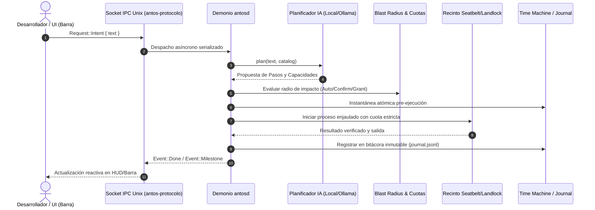
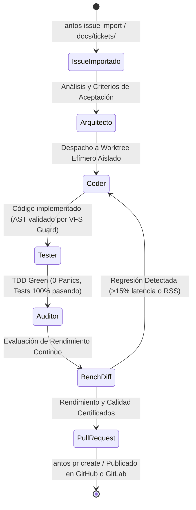

# Arquitectura de antOS

Este documento contiene los diagramas vivos de arquitectura sincronizados continuamente.

<!-- ANTOS_ARCH_START -->
> 📐 **antOS Living Architecture (T21.3)** · Generado automáticamente a partir del código fuente.
> *Crates: 6 | Módulos Demonio: 53 | Capacidades: 113*

### 1. Topología de Componentes y Límites de Seguridad

### 2. Flujo de Datos IPC y Ciclo de Ejecución de Intenciones

### 3. Ciclo de Vida Multi-Agente antFlow

<!-- ANTOS_ARCH_END -->
