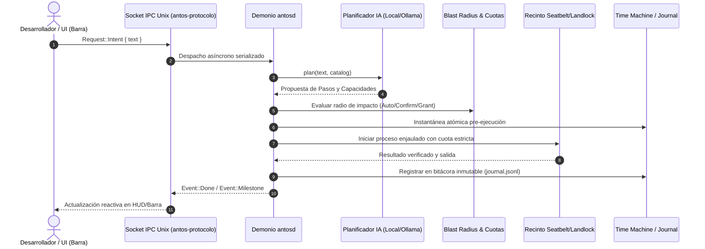
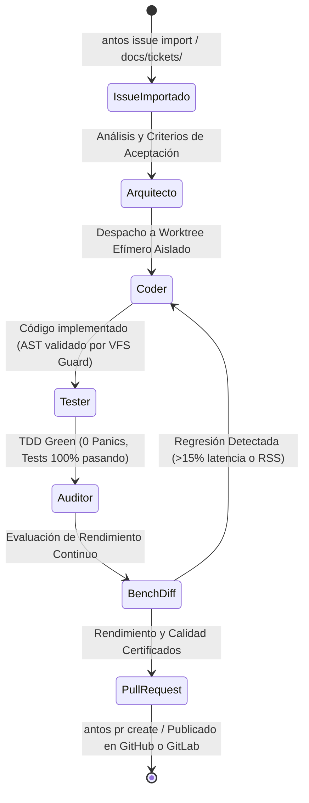
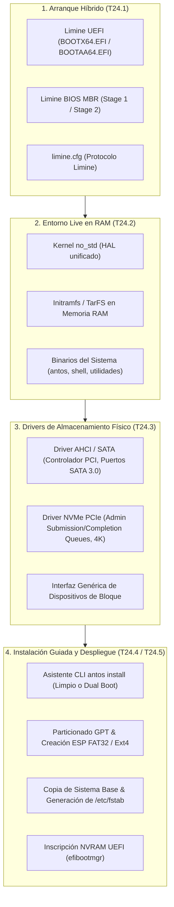
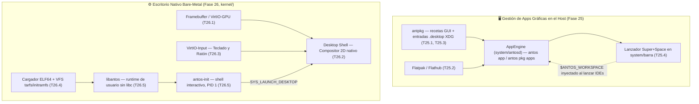
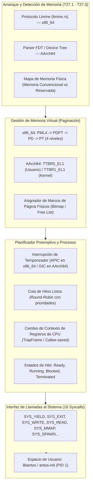
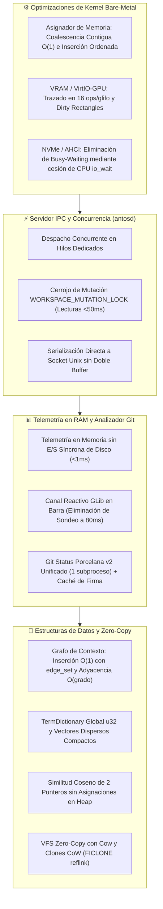

# Arquitectura de antOS

Este documento contiene los diagramas vivos de arquitectura sincronizados continuamente.

<!-- ANTOS_ARCH_START -->
> 📐 **antOS Living Architecture (T21.3)** · Generado automáticamente a partir del código fuente.
> *Crates: 6 | Módulos Demonio: 58 | Capacidades: 122*

### 1. Topología de Componentes y Límites de Seguridad

### 2. Flujo de Datos IPC y Ciclo de Ejecución de Intenciones

### 3. Ciclo de Vida Multi-Agente antFlow

<!-- ANTOS_ARCH_END -->

---

## 4. Arquitectura de Despliegue en Hardware Real (Bare Metal) y Almacenamiento Físico (Fase 24)

A partir de la **Fase 24**, antOS incorpora una cadena de arranque y despliegue completa para hardware físico bare-metal (x86_64 y AArch64):

### Componentes de la Fase 24:
1. **Bootloader Híbrido Limine (`builder::limine`):**
   - Integración nativa en el generador de imágenes `builder`.
   - Soporte para arranque dual: UEFI (GPT + ESP FAT32) y BIOS Legacy (MBR boot sectors).
   - Generación de imágenes ISO híbridas (`.iso`) e imágenes de disco crudo (`.img`).
2. **Empaquetador de Ramdisk Live (`builder::ramdisk`):**
   - Empaquetado del sistema de ficheros en memoria `initramfs` (formato TarFS compatible).
   - Carga en RAM durante el boot para permitir una sesión Live interactiva sin requerir almacenamiento persistente previo.
3. **Drivers de Almacenamiento Físico en Kernel (`kernel::storage`):**
   - **AHCI / SATA:** Detección de controladoras PCI clase almacenamiento, inicialización de puertos HBA y comandos FIS de lectura/escritura DMA.
   - **NVMe PCIe:** Descubrimiento de controladores NVMe sobre PCIe, mapeo de registros BAR0, creación de colas de envío y finalización (Admin Queue Pairs) y lectura/escritura de sectores LBA a alta velocidad.
4. **Instalador Guiado e Interactivo (`system/antosd/src/installer`):**
   - **`antos install`:** Asistente interactivo por pasos o desatendido por archivo TOML (`--config`).
   - Gestión de particiones GPT, formateo limpio o convivencia Dual Boot con Windows/Linux.
   - Copia de sistema base con telemetría visual, configuración de `/etc/fstab` y registro en firmware con `efibootmgr`.
5. **Generador y Grabador Seguro de Live USB (`system/antosd/src/installer/usb.rs`):**
   - **`antos usb build`:** Construcción automatizada de la ISO y generación de hash SHA-256.
   - **`antos usb flash`:** Detección segura de medios extraíbles, bloqueo automático de discos internos del sistema anfitrión, volcado bit a bit con barra de progreso y verificación criptográfica.

---

## 5. Escritorio Nativo Bare-Metal y Gestión de Aplicaciones Gráficas (Fases 25-26)

A partir de las **Fases 25 y 26**, antOS deja de depender de un compositor Wayland externo para tener
interfaz gráfica: el propio kernel `no_std` trae su driver de vídeo, su compositor 2D y un runtime de
espacio de usuario soberano, mientras que en el lado del host `antpkg` y Flatpak convergen en un único
gestor de aplicaciones gráficas.

> **Dos pilas gráficas, dos vías (desde la Fase 29):**
>
> | | Pila | Runtime | Vía |
> | :--- | :--- | :--- | :--- |
> | **`kernel/src/ui/`** (Fase 26) | Compositor 2D propio sobre el framebuffer, sin GTK ni Wayland | Kernel `no_std`, 16 syscalls, sin libc | **Kernel bare-metal** — I+D de soberanía (Fase 29). No ejecuta software POSIX. |
> | **`system/barra`** (GTK4 + `wlr-layer-shell`) | Cliente Wayland de un compositor `wlroots` (Labwc, T13.0) | Linux con `std` | **antOS Linux** — driver diario (Fase 30). Neovim, Git, navegadores, `antos dev`. |
>
> El demonio `antosd` y el CLI `antos` (`system/`) son comunes: corren en el host
> hoy y en la imagen de antOS Linux. El compositor bare-metal y `antos-barra`
> **nunca** comparten proceso ni máquina.
>
> **Escritorio antOS Linux declarativo (T30.1):** `system/nixos/barra.nix`
> empaqueta `antos-barra` con Nix y `system/nixos/desktop.nix` añade el módulo
> `services.antos.desktop` — Labwc + `antos-barra` + terminal + Neovim + Git +
> autologin Wayland (`greetd`), reutilizando los `rc.xml`/`autostart`/
> `environment` de `system/desktop/` (T13.0). Activarlo es
> `services.antos.desktop.enable = true` en el `configuration.nix`.

### Componentes de la Fase 25 (Aplicaciones Gráficas en el Host):
1. **`antpkg` con soporte GUI (T25.1):** genera y registra entradas `.desktop` (Freedesktop) al instalar
   recetas gráficas; `antos pkg apps` las lista, `antos pkg validate` las audita.
2. **Puente Flatpak (T25.2, `system/antosd/src/apps.rs` — `AppEngine`):** unifica el ciclo de vida
   (`list`/`search`/`install`/`run`/`remove`) de aplicaciones nativas (`antpkg`) y en sandbox (Flatpak)
   bajo `antos app`, inyectando el contexto Wayland y el workspace activo al lanzar.
3. **Catálogo Oficial de Navegadores e IDEs (T25.3):** recetas curadas y mantenidas (Firefox, Chrome,
   VS Code, Zed…) descubribles vía `antos pkg search`.
4. **Lanzador en la Barra (T25.4, `system/barra`):** `Super + Space` funciona en modo dual — intención de
   IA o lanzador de aplicaciones estilo Spotlight/Raycast, navegable con `↑`/`↓`/`Tab`/`Enter`.

### Componentes de la Fase 26 (Escritorio Nativo en el Kernel Bare-Metal):
1. **Framebuffer y VirtIO-GPU (T26.1, `kernel/src/arch/aarch64/virtio_gpu.rs`):** detección de
   `simple-framebuffer` vía DTB o de un dispositivo `virtio-gpu` MMIO, con doble buffer.
2. **Desktop Shell y Compositor 2D (T26.2, `kernel/src/ui/`):** compositor, cursor, HUD de intenciones,
   barra de estado y ventana de terminal renderizados directamente sobre el framebuffer — sin GTK ni
   Wayland, código 100% propio.
3. **VirtIO-Input (T26.3, `kernel/src/input/`):** cola de eventos tipados compartida entre el driver
   PS/2 (x86_64) y VirtIO-Input (AArch64); alimenta tanto al compositor como a `SYS_READ`.
4. **Cargador ELF64 e Initramfs/tarfs (T26.4, `kernel/src/elf.rs`, `kernel/src/fs/tarfs.rs`):** carga
   ejecutables de usuario desde un `tarfs` montado sobre el `initrd.tar` embebido en el binario del kernel.
5. **`libantos` y el Shell Soberano (T26.5, `user/`):** biblioteca de runtime sin `glibc`/`musl`
   (asignador sobre `SYS_MMAP`, canales IPC, `print!`/`println!`/`read_line`) y `antos-init` — el binario
   que el kernel ejecuta como **PID 1**, con un shell interactivo (`help`/`info`/`ls`/`cat`/`desktop`/`agent`)
   que puede pedirle al kernel, vía `SYS_LAUNCH_DESKTOP`, que renderice (x86_64, en paralelo gracias al
   planificador preemptivo T23.2) o le ceda el control (AArch64, sin planificador preemptivo aún) al
   compositor gráfico.

---

## 6. Núcleo Soberano Bare-Metal: SMP, Planificador Preemptivo, Paginación y Syscalls (Fases 27-29)

A partir de las **Fases 27 a 29**, el kernel bare-metal `no_std` se consolida como un microkernel soberano multi-arquitectura (x86_64 y AArch64):

1. **Protocolo Limine Nativo (`kernel/src/arch/x86_64/limine.rs`):** Interfaz tipada con el bootloader Limine para recibir mapas de memoria física, framebuffers EFI y módulos initrd sin recurrir a código assembly frágil.
2. **Paginación Multi-Nivel:** Soporte para traducción de direcciones virtuales, protección de memoria mediante bits NX (No-Execute), páginas solo lectura para código del kernel y aislamiento entre espacio de kernel y espacio de usuario.
3. **Planificador Preemptivo por Rondas:** Conmutación de tareas segura activada por interrupciones periódicas de temporizador, permitiendo multitarea real entre el shell soberano y el compositor gráfico.

---

## 7. antOS Linux Declarativo como Driver Diario (Fase 30)

La **Fase 30** establece antOS Linux como el entorno de trabajo diario del desarrollador sobre hardware físico y máquinas virtuales aceleradas:

1. **Sesión Wayland Declarativa con Labwc (`system/nixos/desktop.nix`):**
   - Integración nativa del compositor Wayland ultraligero `labwc` con `services.antos.desktop`.
   - Autologin con `greetd`, barra de escritorio `system/barra` acoplada vía `wlr-layer-shell`, terminal interactivo y Neovim preconfigurado.
2. **Aceleración por Hardware en macOS (`system/arrancar-vm-macos.sh`):**
   - Construcción de imagen booteable en contenedor Docker y arranque inmediato en el host con `qemu-system-aarch64 -accel hvf`.
   - Rendimiento casi nativo para pruebas del entorno de escritorio completo en segundos.

---

## 8. Arquitectura de Rendimiento y Subsistemas de Alta Eficiencia (Fase 32)

La **Fase 32** implementa una auditoría y optimización integral de algoritmos, contención de cerrojos, consumo de memoria y E/S a través de todo el sistema operativo:

### Componentes Clave de Rendimiento (Fase 32):

1. **Asignador de Memoria del Kernel (`kernel/src/mm/allocator.rs` — T32.1):**
   - Coalescencia contigua completa (fusión con bloque anterior, siguiente o ambos en sándwich) e inserción ordenada físicamente en la lista enlazada libre.
   - Métricas de consumo (`allocated_bytes`, `used()`, `free()`) en tiempo constante $O(1)$ sin recorrer la lista libre.
   - Reciclaje diferido de pilas de kernel (16 KiB) en el planificador preemptivo tras completar el cambio de contexto para evitar fragmentación y OOM.
2. **Aceleración de Framebuffer y VirtIO-GPU (`kernel/src/ui/mod.rs`, `kernel/src/arch/aarch64/virtio_gpu.rs` — T32.2):**
   - Optimización del renderizado de glifos en mapa de bits: reducción de 128 operaciones base por carácter a 16 operaciones estructuradas por fila.
   - Llenado contiguo de memoria en `draw_rect` fila a fila y operaciones de borrado rápido mediante `slice::fill`.
   - Seguimiento estricto de rectángulos dañados (*dirty rectangles*), evitando flushes completos de pantalla hacia el dispositivo VirtIO en saltos de línea.
3. **Servidor IPC Concurrente y Desacoplamiento de Mutación (`system/antosd/src/ipc_server.rs`, `main.rs` — T32.3):**
   - Arquitectura concurrente con despacho de cada conexión de cliente en un hilo independiente del sistema operativo.
   - Sustitución de exclusión mutua global por cerrojo de grano fino `WORKSPACE_MUTATION_LOCK`: las consultas de lectura (`status`, `health`, `metrics`, `graph`) se resuelven en <50 ms incluso durante sesiones interactivas de terminal o streaming de logs.
   - Eliminación de asignación de búferes intermedios serializando directamente el mensaje `antos-protocolo` al flujo del socket Unix.
4. **Telemetría en RAM y Canal Reactivo GLib (`system/antosd/src/telemetry.rs`, `system/barra/src/main.rs` — T32.4):**
   - Telemetría de salud y rendimiento mantenida en RAM sin escrituras síncronas a disco en la ruta crítica (<1 ms).
   - Inserción y desalojo de alertas en tiempo constante $O(1)$ mediante `VecDeque`.
   - Eliminación del bucle de sondeo activo a 80 ms en `system/barra`, reemplazado por un canal reactivo (`async_channel::unbounded` + `glib::spawn_future_local`) con despacho por eventos.
5. **Analizador Git Unificado y Caché con Signatura (`system/capabilities/src/git.rs`, `system/antosd/src/git.rs` — T32.5):**
   - Sustitución de múltiples invocaciones de Git (`status`, `diff`, `rev-parse`, `branch`) por una única consulta unificada `git status --porcelain=v2 --branch`, reduciendo subprocesos en un 75%.
   - Caché de estado basada en `WorktreeSignature` (mtime de `.git/index`, `HEAD` y archivos rastreados), invalidando de forma inmediata cuando el desarrollador edita ficheros sin necesidad de `git add`.
   - Memoización de `detect_antos_root()` para resolver rutas de repositorio en $O(1)$.
6. **Eliminación de Espera Activa en Controladores de Almacenamiento (`kernel/src/storage/` — T32.6):**
   - Eliminación de bucles de espera activa de millones de iteraciones de CPU en comandos NVMe y AHCI SATA.
   - Integración con el planificador para ceder el turno de CPU (`io_wait`) y suspender hilos de E/S (`ThreadState::Blocked`) hasta que el hardware señale disponibilidad o expire un temporizador calibrado por ticks.
7. **Grafo de Contexto $O(1)$, Diccionario Léxico y Visor de Diffs (`system/antosd/src/memory.rs`, `diff_view.rs` — T32.7):**
   - Inserción de aristas en `ContextGraph::add_edge` en tiempo amortizado $O(1)$ con `edge_set` (`HashSet<(String, String, EdgeKind)>`) y resolución de relaciones en $O(\text{grado})$ con índice de adyacencia.
   - Vocabulario global `TermDictionary` con asignación de IDs `u32`, transformando vectores de `SemanticChunk` a vectores dispersos compactos `Vec<(u32, f32)>` ordenados por término.
   - Cálculo de similitud coseno (`cosine_similarity_sparse`) mediante algoritmo de dos punteros de avance lineal $O(L_1 + L_2)$ en memoria contigua sin asignaciones en el heap.
   - Visor de diffs sintáctico con búsqueda binaria $O(\log K)$ sobre tablas estáticas ordenadas de palabras clave y procesamiento en streaming sin asignación de vectores intermedios por línea.
8. **VFS Zero-Copy y Clones Copy-on-Write (`system/antosd/src/vfs.rs`, `snapshot.rs`, `ci.rs` — T32.8):**
   - Lectura sin copias en el sistema de ficheros virtual `/antfs` empleando `Cow<'static, [u8]>` para ficheros estáticos de memoria.
   - Soporte nativo de instantáneas atómicas CoW (`FICLONE` / reflink) en sistemas Linux con Btrfs o XFS, acelerando la creación de snapshots de workspace de segundos a sub-milisegundos.
   - Paralelización de etapas independientes de integración continua local (`antos ci`) con `std::thread::scope`.

