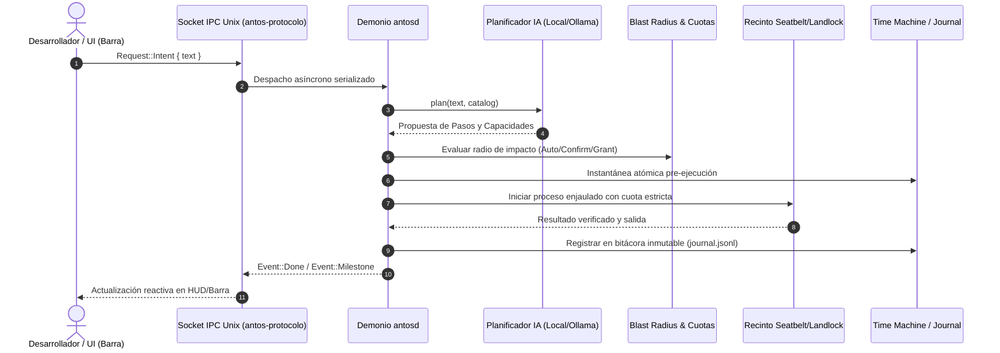
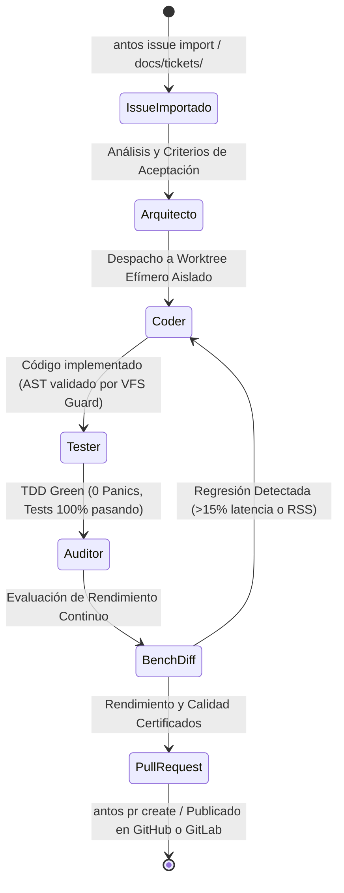
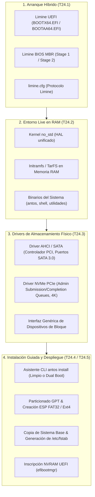

# Arquitectura de antOS

Este documento contiene los diagramas vivos de arquitectura sincronizados continuamente.

<!-- ANTOS_ARCH_START -->
> 📐 **antOS Living Architecture (T21.3)** · Generado automáticamente a partir del código fuente.
> *Crates: 6 | Módulos Demonio: 55 | Capacidades: 113*

### 1. Topología de Componentes y Límites de Seguridad

### 2. Flujo de Datos IPC y Ciclo de Ejecución de Intenciones

### 3. Ciclo de Vida Multi-Agente antFlow

<!-- ANTOS_ARCH_END -->

---

## 4. Arquitectura de Despliegue en Hardware Real (Bare Metal) y Almacenamiento Físico (Fase 24)

A partir de la **Fase 24**, antOS incorpora una cadena de arranque y despliegue completa para hardware físico bare-metal (x86_64 y AArch64):

### Componentes de la Fase 24:
1. **Bootloader Híbrido Limine (`builder::limine`):**
   - Integración nativa en el generador de imágenes `builder`.
   - Soporte para arranque dual: UEFI (GPT + ESP FAT32) y BIOS Legacy (MBR boot sectors).
   - Generación de imágenes ISO híbridas (`.iso`) e imágenes de disco crudo (`.img`).
2. **Empaquetador de Ramdisk Live (`builder::ramdisk`):**
   - Empaquetado del sistema de ficheros en memoria `initramfs` (formato TarFS compatible).
   - Carga en RAM durante el boot para permitir una sesión Live interactiva sin requerir almacenamiento persistente previo.
3. **Drivers de Almacenamiento Físico en Kernel (`kernel::storage`):**
   - **AHCI / SATA:** Detección de controladoras PCI clase almacenamiento, inicialización de puertos HBA y comandos FIS de lectura/escritura DMA.
   - **NVMe PCIe:** Descubrimiento de controladores NVMe sobre PCIe, mapeo de registros BAR0, creación de colas de envío y finalización (Admin Queue Pairs) y lectura/escritura de sectores LBA a alta velocidad.
4. **Instalador Guiado e Interactivo (`system/antosd/src/installer`):**
   - **`antos install`:** Asistente interactivo por pasos o desatendido por archivo TOML (`--config`).
   - Gestión de particiones GPT, formateo limpio o convivencia Dual Boot con Windows/Linux.
   - Copia de sistema base con telemetría visual, configuración de `/etc/fstab` y registro en firmware con `efibootmgr`.
5. **Generador y Grabador Seguro de Live USB (`system/antosd/src/installer/usb.rs`):**
   - **`antos usb build`:** Construcción automatizada de la ISO y generación de hash SHA-256.
   - **`antos usb flash`:** Detección segura de medios extraíbles, bloqueo automático de discos internos del sistema anfitrión, volcado bit a bit con barra de progreso y verificación criptográfica.

