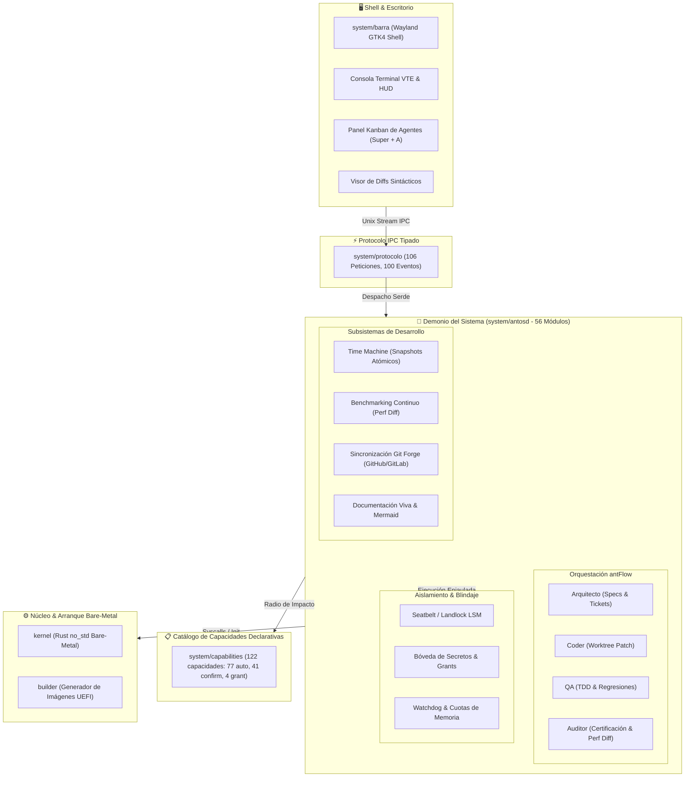
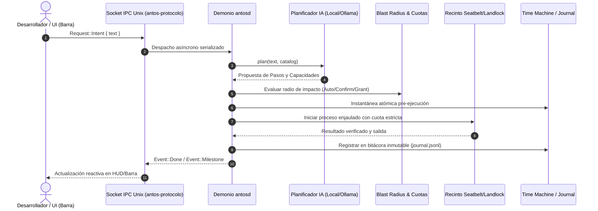
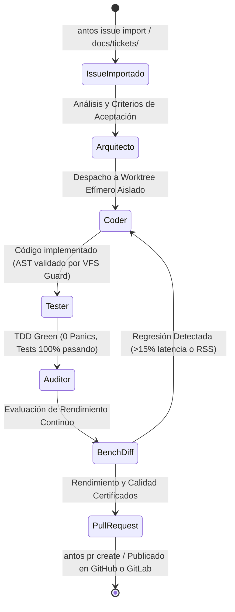
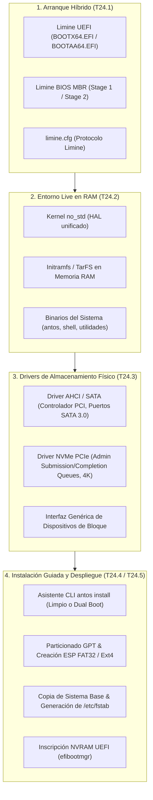
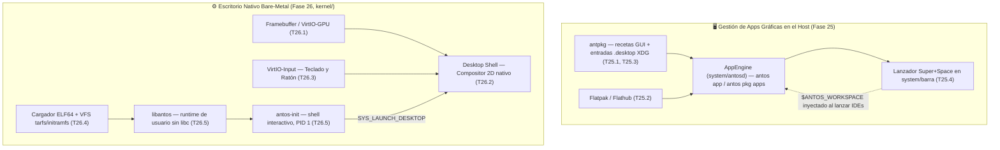

# Arquitectura de antOS

Este documento contiene los diagramas vivos de arquitectura sincronizados continuamente.

<!-- ANTOS_ARCH_START -->
> 📐 **antOS Living Architecture (T21.3)** · Generado automáticamente a partir del código fuente.
> *Crates: 6 | Módulos Demonio: 56 | Capacidades: 122*

### 1. Topología de Componentes y Límites de Seguridad

### 2. Flujo de Datos IPC y Ciclo de Ejecución de Intenciones

### 3. Ciclo de Vida Multi-Agente antFlow

<!-- ANTOS_ARCH_END -->

---

## 4. Arquitectura de Despliegue en Hardware Real (Bare Metal) y Almacenamiento Físico (Fase 24)

A partir de la **Fase 24**, antOS incorpora una cadena de arranque y despliegue completa para hardware físico bare-metal (x86_64 y AArch64):

### Componentes de la Fase 24:
1. **Bootloader Híbrido Limine (`builder::limine`):**
   - Integración nativa en el generador de imágenes `builder`.
   - Soporte para arranque dual: UEFI (GPT + ESP FAT32) y BIOS Legacy (MBR boot sectors).
   - Generación de imágenes ISO híbridas (`.iso`) e imágenes de disco crudo (`.img`).
2. **Empaquetador de Ramdisk Live (`builder::ramdisk`):**
   - Empaquetado del sistema de ficheros en memoria `initramfs` (formato TarFS compatible).
   - Carga en RAM durante el boot para permitir una sesión Live interactiva sin requerir almacenamiento persistente previo.
3. **Drivers de Almacenamiento Físico en Kernel (`kernel::storage`):**
   - **AHCI / SATA:** Detección de controladoras PCI clase almacenamiento, inicialización de puertos HBA y comandos FIS de lectura/escritura DMA.
   - **NVMe PCIe:** Descubrimiento de controladores NVMe sobre PCIe, mapeo de registros BAR0, creación de colas de envío y finalización (Admin Queue Pairs) y lectura/escritura de sectores LBA a alta velocidad.
4. **Instalador Guiado e Interactivo (`system/antosd/src/installer`):**
   - **`antos install`:** Asistente interactivo por pasos o desatendido por archivo TOML (`--config`).
   - Gestión de particiones GPT, formateo limpio o convivencia Dual Boot con Windows/Linux.
   - Copia de sistema base con telemetría visual, configuración de `/etc/fstab` y registro en firmware con `efibootmgr`.
5. **Generador y Grabador Seguro de Live USB (`system/antosd/src/installer/usb.rs`):**
   - **`antos usb build`:** Construcción automatizada de la ISO y generación de hash SHA-256.
   - **`antos usb flash`:** Detección segura de medios extraíbles, bloqueo automático de discos internos del sistema anfitrión, volcado bit a bit con barra de progreso y verificación criptográfica.

---

## 5. Escritorio Nativo Bare-Metal y Gestión de Aplicaciones Gráficas (Fases 25-26)

A partir de las **Fases 25 y 26**, antOS deja de depender de un compositor Wayland externo para tener
interfaz gráfica: el propio kernel `no_std` trae su driver de vídeo, su compositor 2D y un runtime de
espacio de usuario soberano, mientras que en el lado del host `antpkg` y Flatpak convergen en un único
gestor de aplicaciones gráficas.

### Componentes de la Fase 25 (Aplicaciones Gráficas en el Host):
1. **`antpkg` con soporte GUI (T25.1):** genera y registra entradas `.desktop` (Freedesktop) al instalar
   recetas gráficas; `antos pkg apps` las lista, `antos pkg validate` las audita.
2. **Puente Flatpak (T25.2, `system/antosd/src/apps.rs` — `AppEngine`):** unifica el ciclo de vida
   (`list`/`search`/`install`/`run`/`remove`) de aplicaciones nativas (`antpkg`) y en sandbox (Flatpak)
   bajo `antos app`, inyectando el contexto Wayland y el workspace activo al lanzar.
3. **Catálogo Oficial de Navegadores e IDEs (T25.3):** recetas curadas y mantenidas (Firefox, Chrome,
   VS Code, Zed…) descubribles vía `antos pkg search`.
4. **Lanzador en la Barra (T25.4, `system/barra`):** `Super + Space` funciona en modo dual — intención de
   IA o lanzador de aplicaciones estilo Spotlight/Raycast, navegable con `↑`/`↓`/`Tab`/`Enter`.

### Componentes de la Fase 26 (Escritorio Nativo en el Kernel Bare-Metal):
1. **Framebuffer y VirtIO-GPU (T26.1, `kernel/src/arch/aarch64/virtio_gpu.rs`):** detección de
   `simple-framebuffer` vía DTB o de un dispositivo `virtio-gpu` MMIO, con doble buffer.
2. **Desktop Shell y Compositor 2D (T26.2, `kernel/src/ui/`):** compositor, cursor, HUD de intenciones,
   barra de estado y ventana de terminal renderizados directamente sobre el framebuffer — sin GTK ni
   Wayland, código 100% propio.
3. **VirtIO-Input (T26.3, `kernel/src/input/`):** cola de eventos tipados compartida entre el driver
   PS/2 (x86_64) y VirtIO-Input (AArch64); alimenta tanto al compositor como a `SYS_READ`.
4. **Cargador ELF64 e Initramfs/tarfs (T26.4, `kernel/src/elf.rs`, `kernel/src/fs/tarfs.rs`):** carga
   ejecutables de usuario desde un `tarfs` montado sobre el `initrd.tar` embebido en el binario del kernel.
5. **`libantos` y el Shell Soberano (T26.5, `user/`):** biblioteca de runtime sin `glibc`/`musl`
   (asignador sobre `SYS_MMAP`, canales IPC, `print!`/`println!`/`read_line`) y `antos-init` — el binario
   que el kernel ejecuta como **PID 1**, con un shell interactivo (`help`/`info`/`ls`/`cat`/`desktop`/`agent`)
   que puede pedirle al kernel, vía `SYS_LAUNCH_DESKTOP`, que renderice (x86_64, en paralelo gracias al
   planificador preemptivo T23.2) o le ceda el control (AArch64, sin planificador preemptivo aún) al
   compositor gráfico.

